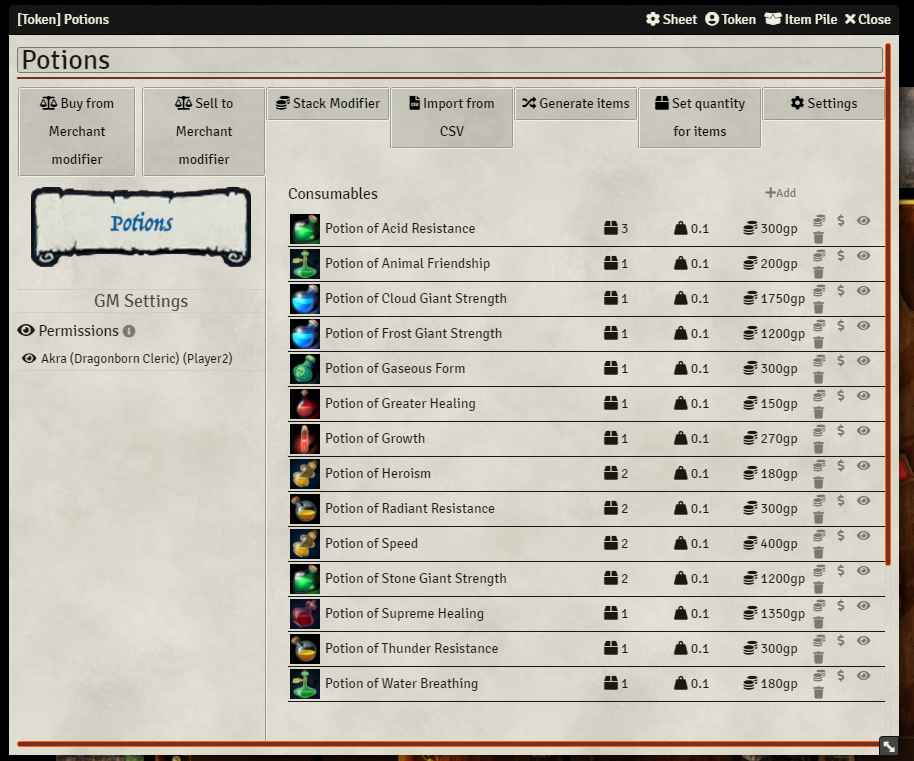
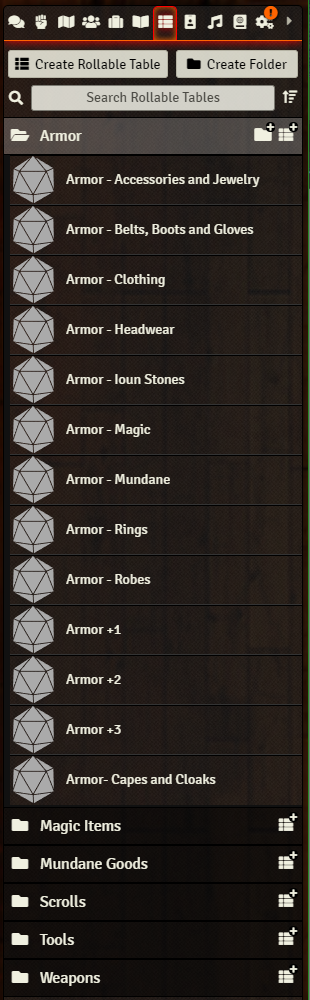
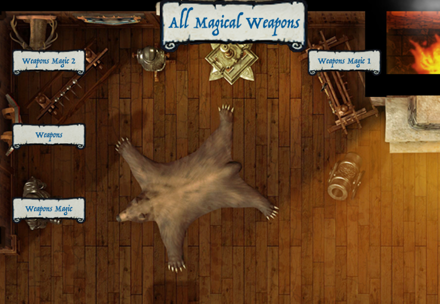
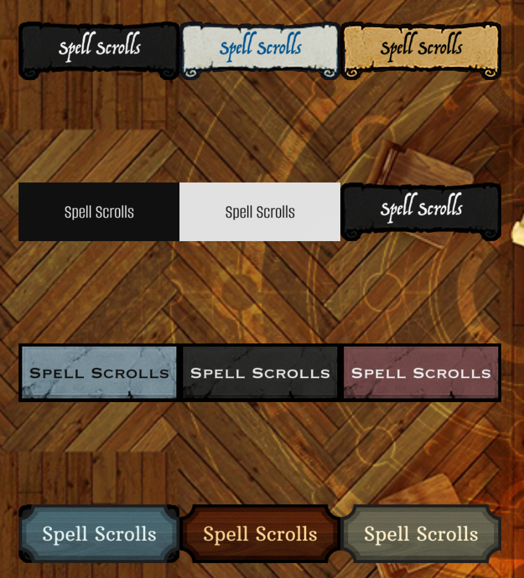
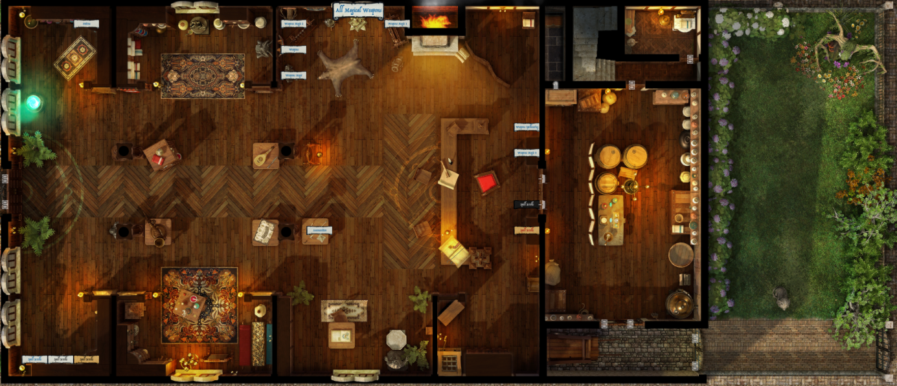

# Grimm & Tor's Shoppes of Yore
A shopping module providing pre-sorted RollTables of the 5e SRD by category, various art assets to facilitate making shops, and some example scenes and actors to fire your creativity.

# Dependencies
[Merchant NPC Sheet](https://foundryvtt.com/packages/merchantsheetnpc)

This module was built using the `Merchant NPC Sheet` mod, and the pre-generated actors are all using that sheet setting.  For more information of Merchant NPCs, please refer to that mod.  You could try using any other loot or merchant mod that uses `RollTables` to populate.

# Installation
- Install from Foundry or manually via the manifest.
- Import the desired `compendia`.  
  - I recommend you start with the spell scroll `compendia` if you want them, and then the `rolltables`, and then `actors`, if you are going to use our pre-generated actors.  Then the `scenes`.
  - You may want to set up folders for this or sort them, as there are quite a few.
- The actors are set up as "shelves" with titles indicating what they have pre-stocked.
- Adjust permissions on the actors so you players can interact with them.
- Review the items, re-stock or manually add items to taste, and check on prices.  Sometimes the prices require you to close and reopen the NPC sheet to take effect.  All prices are from the SRD compendium.

# Basic Design
## Compendia and RollTables
This module has sorted all of the items in the 5e SRD into various `RollTable` entities, drawing directly from the `Items (SRD)` and `Trade Goods (SRD)` compendia.  The exception is spell scrolls, which were created as items and then placed in item compendia by spell level.  From those, roll tables for spell scrolls were also built.  Those `RollTables` are then used either on their own, or in some cases combined into weighted tables that draw from other tables.  In the end all merchant NPCs can be relatively easily populated via the various `RollTables` in the module compendia!

## Actors and Labels
On top of that we have created almost a dozen styles of labels you can use to label "shelves".  As we played with ways to manage large or diverse inventories, we decided having "shelves", or actors with labels for a particular sets of items, was more like shopping in a real store than having the actual merchant hold all the stuff.

There are about a dozen premade "shelf" actors, and about 15 styles of label, each with about 60 variants that cover most groups of items in the SRD.   

## Scenes
Currently we have one premade scene, a Magic Shoppe that is a good example of using the shelf approach in action.

# Contents
## Compendia
- Shoppes Actors - About 20 premade shelf actors
- Shoppes Magic Scrolls (by level)
- Shoppes Journals - Contains the Readme in game
- Shoppes Tables - All the roll tables
- Shoppes Scenes - Currently the Magic Shoppe
