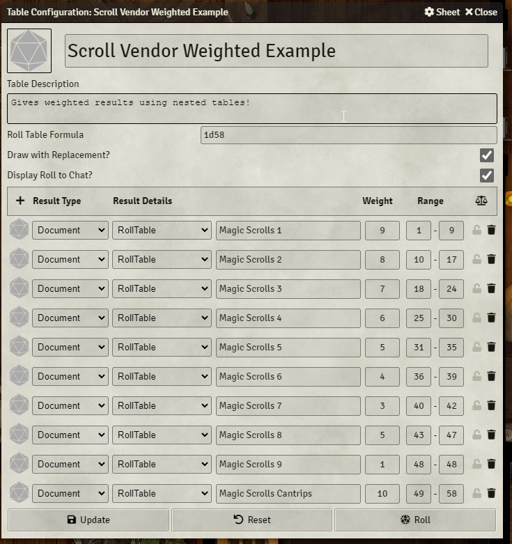

# Grimm & Tor's Shoppes of Yore
A shopping module providing pre-sorted RollTables of the 5e SRD by category, various art assets to facilitate making shops, and some example scenes and actors to fire your creativity.

# Dependencies
[Merchant NPC Sheet](https://foundryvtt.com/packages/merchantsheetnpc)

This module was built using the `Merchant NPC Sheet` mod, and the pre-generated actors are all using that sheet setting.  For more information of Merchant NPCs, please refer to that mod.  You could try using any other loot or merchant mod that uses `RollTables` to populate.

# Installation
- Install from Foundry or manually via the manifest.
- Import the desired `compendia`.  
  - I recommend you start with the spell scroll `compendia` if you want them, and then the `rolltables`, and then `actors`, if you are going to use our pre-generated actors.  Then the `scenes`.
  - You may want to set up folders for this or sort them, as there are quite a few.
- The actors are set up as "shelves" with titles indicating what they have pre-stocked.
- Adjust permissions on the actors so you players can interact with them.
- Review the items, re-stock or manually add items to taste, and check on prices.  Sometimes the prices require you to close and reopen the NPC sheet to take effect.  All prices are from the SRD compendium.

# Basic Design
## Compendia and RollTables
This module has sorted all of the items in the 5e SRD into various `RollTable` entities, drawing directly from the `Items (SRD)` and `Trade Goods (SRD)` compendia.  The exception is spell scrolls, which were created as items and then placed in item compendia by spell level.  From those, roll tables for spell scrolls were also built.  Those `RollTables` are then used either on their own, or in some cases combined into weighted tables that draw from other tables.  In the end all merchant NPCs can be relatively easily populated via the various `RollTables` in the module compendia!

## Actors and Labels
On top of that we have created almost a dozen styles of labels you can use to label "shelves".  As we played with ways to manage large or diverse inventories, we decided having "shelves", or actors with labels for a particular sets of items, was more like shopping in a real store than having the actual merchant hold all the stuff.

There are premade "shelf" actors with a blue text on white scroll label for most categories of goods. These actors mostly have 1 of every item on the respective `rolltable`.

There are about 15 styles of label, each with about 60 variants that cover most groups of items in the SRD.  The images are in `/assets/images/labels` and organized by style.

The labels themselves do not map to the categories exactly as we decided to use "in lore" names where we could for flavor, and label lists very explicitly.  So there is no "Alchemy" label, but there is an "Apothecary" label.  We may update this in the future!

## Scenes
Currently we have one premade scene, a Magic Shoppe that is a good example of using the shelf approach in action.

# Customizing Your Merchants
You can use the default actors.  They mostly come with one of every item in a given table in their inventory.  However, I would recommend re-rolling the table randomly for things like scrolls, magic items, and other more exotic goods.  You can also drag items onto the merchant to stock specific things you want.

If you want to make `rolltables` you can do so, and just use the interface in MerchantNPC to update the inventory.

You can also nest tables within tables to do nifty things like set up the relative rarity of items.  So you could have a Scroll Vendor who uses a table which rolls on other tables with weighted rolls:

# Contents
## Compendia
- Shoppes Actors - Premade shelf actors
- Shoppes Items - Magic Scrolls for all SRD spells (organized by level)
- Shoppes Journals - Contains the Readme in game
- Shoppes Tables - All the rolltables
- Shoppes Scenes
  - Magic Shoppe

## Label Locations
Where to find all the variant labels:
### Non-Forge Installs
The location for assets should be in modules/grimm-and-tors-shoppes-of-yore/assets/images/labels.  If you have moved modules to another location, please look there.
### Forge Manual Installs
The location will be similar to the above, but will be somewhere in your "My Assets Library" tab.
### Forge Bazaar Installs
The assets will be similar to above, but in the "The Bazaar" tab.

# Known Issues
## Nested Tables and MerchantNPC
A small number of the tables in this mod use nested tables.  Usually this happens when we combine tables like each tier of magic item, or each tier of magic scroll.  These appear to only work when populating the merchant NPC sheet if you let it roll some number of times for "Shop Qty".  It will not allow you to check the ALL box.  Actors where this is known to happen, and we have randomly seeded the actors:
- Armor - Magic All
- Magic Scrolls (All Tiers and All)
- Weapons - Magic All
